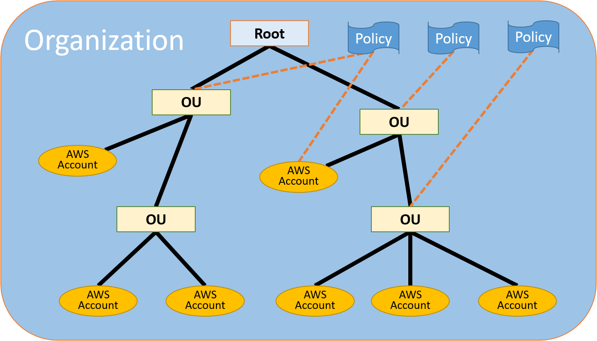

# S3

S3 provides developers and IT teams with secure, durable, highly-scalable object storage. Amazon S3 is easy to use, with a simple web services interface to store and retrieve any amount of data from anywhere on the web

- S3 is a safe place to store your files
- It is Object-based storage
- The data is spread across multiple devices and facilities

## 1. The basics of S3

- S3 is **Object-based** \-\- i.e. allows you to upload files
- Files can be form 0 Bytes to 5TB.
- There is unlimited storage
- Files are stored in Buckets.
- S3 is a universal namespace. That is, names must be unique globally
- When you upload a file to S3, you willl receive a HTTP 200 code if the upload was successful

### 1) S3 is Object based. Think of Objects just as files.

Objects consist of the following:

- Key (This is simply the name of the object)
- Value (This is simply the data and is made up of a sequence of bytes)
- Version ID (Important for versioning)
- Metadata (Data about data you are storing)
- Subresources (Access Control Lists, Torrent)

### 2) How does data consistency work for S3?

- If you write a new file and read it immediately afterwards, you will be able to view that data
- If you update AN EXISTING file or delete a file and read it immediately, you may get the older version, or you may not. Basically changes to objects can take a little bit of time to propagate.

### 3) S3 has the following features

- Tiered Storage Available
- Lifecycle Management
- Versioning
- Encryption
- MFA Delete
- Secure your data using **Access Control Lists** and **Bucket Policies**

### 4) You are charged for S3 in the following ways

- Storage
- Requests
- Storage Managment Pricing
- Data Transfer Pricing
- Transfer Acceleration (Permission of object)
- Cross Region Replication Pricing

### 5) S3 Transfer Acceleration

Amazon S3 Transfer Acceleration enables fast, easy, and secure transfer of files over long distances between your end users and an s3 bucket.

Transfer Acceleration takes advantage of Amazon CloudFront's globally distributed edge location. As the data arrives at an edge location, data is routes to Amazon S3 over an optimized network path.

 

## 2. S3 Storage Classes

#### [자주 액세스 하는 객체를 위한 스토리지 클래스]

#### (1) S3 Standard

- 99.99% availability 99.999999999% durability, stored redundantly across multiple devices in multiple facilities, and is designed to sustain the loss of 2 facilities concurrently

 

#### [자주 액세스하는 객체와 자주 액세스하지 않는 객체를 자동으로 최적화하는 스토리지 클래스]

#### (1) S3 Intelligent-Tiering

- Designed to optimize costs by automatically moving data to the most cost-effective access tier, without performance impact or operational overhead.
- S3 Intelligent-Tiering 스토리지 클래스는 성능 영향 또는 운영 오버헤드 없이 가장 비용 효율적인 스토리지 액세스 계층으로 데이터를 자동으로 이동하여 스토리지 비용을 최적화하도록 설계되었습니다.
- S3 Intelligent-Tiering은 액세스 패턴이 변경될 때 자주 액세스하는 계층과 저렴한 비용의 자주 액세스하지 않는 계층 간에 세분화된 객체 수준의 데이터를 이동함으로써 자동 비용 절감 효과를 제공합니다.
- Intelligent-Tiering 스토리지 클래스는 액세스 패턴을 알 수 없거나 예측할 수 없어 수명이 긴 데이터에 대해 스토리지 비용을 자동으로 최적화하려는 경우 이상적입니다.
- S3 Intelligent-Tiering 스토리지 클래스는 두 액세스 계층에 객체를 저장합니다. 한 계층은 자주 액세스하는 데이터에 최적화되어 있으며 비용이 저렴한 다른 계층은 자주 액세스하지 않는 데이터에 최적화되어 있습니다.

 

#### [자주 액세스하지 않는 객체를 위한 스토리지 클래스]

Amazon S3는 이러한 객체에 대한 검색 요금을 부과하므로 이러한 객체는 자주 액세스되지 않는 데이터에 가장 적합합니다.

#### (1) S3 - IA (Infrequently Accessed)

- For data that is accessed less frequently, but requires rapid access when needed. Lower fee than S3, but you charged a retrieval fee.
- Amazon S3가 객체 데이터를 지리적으로 분리된 여러 개의 가용 영역에 중복 저장합니다(S3 Standard 스토리지 클래스와 유사함). S3 Standard-IA 객체는 가용 영역의 손실에 대한 복원성이 있습니다. 이 스토리지 클래스는 S3 One Zone-IA 클래스보다 뛰어난 가용성 및 복원성을 제공합니다.

#### (2) S3 One Zone - IA

- For where you wnat a lower-cost option for infrequently accessed data, but do not require the multiple Availability Zone data resilience.
- Amazon S3가 객체 데이터를 한 개의 가용 영역에만 저장하므로 S3 Standard-IA보다 비용이 더 저렴합니다. 그러나 데이터는 지진 및 홍수와 같은 재해에 의한 가용 영역의 물리적 손실에 대해서는 복원성이 없습니다.

 

#### [객체 아카이빙을 위한 스토리지 클래스]

저비용 데이터 아카이빙을 위해 설계되었습니다. 이러한 스토리지 클래스는 S3 Standard 스토리지 클래스와 동일한 내구성과 복원성을 제공합니다.

#### (1) S3 Glacier

- S3 Glacier is a secure, durable, and low-cost storage class for data archiving. You can reliably store any amount of data at costs that are competitive with or cheaper than on-premises solutions. Retrieval times configurable from minutes to hours
- 분 단위로 데이터의 일부를 검색해야 하는 아카이브에 사용합니다. S3 Glacier 스토리지 클래스에 저장된 데이터는 최소 스토리지 기간이 90일이며 신속 검색을 사용하여 최소 1~5분 이내에 액세스할 수 있습니다.

#### (2) S3 Glacier Deep Archive

- S3 Glacier Deep Archive is Amazon S3's lowest-cost storage class where a retrieval time of 12 hours is acceptable
- 거의 액세스할 필요가 없는 데이터를 보관할 때 사용합니다. S3 Glacier Deep Archive 스토리지 클래스에 저장된 데이터의 최소 스토리지 기간은 180일이고 기본 검색 시간은 12시간입니다.

 

## 3. 객체 관련 작업

- control access to buckets using either a **bucket ACL** or using **Bucket Polices**

#### (1) 객체 업로드

- **단일 작업으로 객체 업로드**: 단일 PUT 작업으로 최대 5GB 크기의 객체를 업로드할 수 있습니다.
- **파트로 나누어 객체 업로드**: 멀티파트 업로드 API를 사용하여 최대 5TB의 대형 객체를 업로드할 수 있습니다.

멀티파트 업로드 API는 대용량 객체의 업로드 경험을 개선하기 위해 디자인되었습니다. 객체를 파트별로 업로드할 수 있습니다. 이러한 객체 파트는 임의의 순서로 독립적으로, 그리고 병렬적으로 업로드할 수 있습니다. 크기가 5MB에서 5TB까지인 객체에 대해 멀티파트 업로드를 사용할 수 있습니다.

 

## 4. S3 Pricing Tiers

### 1) What makes up the cost of S3?

- Storage
- Request and Data Retrievals
- Data Transfer
- Management & Replication

### 2) What are the different Tiers?

- S3 Standard
- S3 - IA
- S3 One Zone - IA
- S3 - Intelligent Tiering
- S3 Glacier
- S3 Glacier Deep Archive

## 5. S3 Security & Encryption

By default, all newly created buckets are PRIVATE. You can setup access control to your buckets using;

- Bucket Policies (Bucket Level)
- Access Control Lists (individual objects)

S3 buckets can be configured to create access logs which log all requests made to the S3 bucket. This can be sent to another bucket and event another bucket in another account

Encryption In Transit is achieved by

- SSL/TLS

Encryption At Rest(Server Side) is achieved by

- S3 Managed Keys - SSE-S3
- AWS Key Managements Service, Managed Keys - SSE-KMS
- Server Side Encryption With Customer Proviede Keys - SSE-C

Client Side Encryption

## 6. S3 Version Control

Using **Versioning** With S3;

- Stores all versions of an object (including all writes and even if you delete an object)
- Great backup tool
- Once enabled, Versioning cannot be disabled, only suspended.
- Integrates with Lifecycle rules
- Versioning's **MFA Delete** capability, which uses multi-factor, can be used to provide an additional layer of security.

## 7. Sharing S3 Buckets Between Account

### 1) 3 different ways to share S3 buckets across accounts

- Using Bucket Policies & IAM (applies accross the entire bucket). Programmatic Access Only.
- Using Bucket ACLs & IAM (individual objects). Programmatic Access Only.
- Cross-account IAM Roles. Programmatic And Console access.

## 8. Cross Region Replication

복제는 Amazon S3 버킷 간에 객체를 비동기식으로 자동 복제할 수 있게 한다. 객체 복제를 위해 구성된 버킷은 동일한 AWS 계정 또는 다른 계정이 소유할 수 있다. 다른 AWS 리전 간에, 또는 동일한 리전 내에서 객체를 복사할 수 있다.

- Versioning must be enabled on both the source and destination buckets
- Files in an existing bucket are not replicated automatically
- All subsequent updated files will be replicated automatically
- Delete markers are not replicated
- Deleting individual versions or delete markers will not be replicated

### 1) 객체 복제 유형

다른 AWS 리전 간에, 또는 동일한 AWS 리전 내에서 객체를 복사할 수 있다.

- **교차 리전 복제(CRR)**: 서로 다른 AWS 리전의 Amazon S3 버킷에서 객체를 복사하는데 사용된다
- **동일 리전 복제(SRR)**: 같은 AWS 리전의 Amazon S3 버킷에서 객체를 복사하는데 사용된다.

### 2) 복제 요구 사항

- 원본 버킷 소유자는 자신의 계정에 대해 원본 및 대상 AWS 리전을 활성화해야 하며, 대상 버킷 소유자는 자신의 계정에 대해 대상 리전을 활성화해야 한다.
- 원본 버킷과 대상 버킷 모두 버전 관리를 활성화해야 한다.
- Amazon S3가 사용자를 대신해서 대상 버킷에 해당 원본 버킷의 객체를 복제할 권한을 가지고 있어야 한다.

## 9. S3 Transfer Acceleration

Amazon S3 Transfer Acceleration은 거리가 먼 클라이언트와 S3 버킷 간에 파일을 빠르고, 쉽고, 안전하게 전송할 수 있게 해준다. Transfer Acceleration은 전세계적으로 분산되어 있는 Amazon CloudFront의 엣지 로케이션을 활용한다. 로케이션에 도착한 데이터는 최적화된 네트워크 경로를 통해 Amazon S3로 라우팅된다.
S3 Transfer Acceleration utilises the CloudFront Edge Network to ccelerate your uploads to S3. Instead of uploading directly to your S3 bucket,
you can use a distinct URL to upload directly to an edge location whice will then transfer that file to S3. you will get a distinct URL to upload to:

yoojh9.s3-accelerate.amazonaws.com

### 1) Amazon S3 Transfer Acceleration을 사용하는 이유는 무엇인가?

- 전 세계 각지에서 중앙의 버킷으로 업로드하는 고객이 있을 경우
- 전 세계에 정기적으로 수 기가바이트에서 수 테라바이트의 데이터를 전송할 경우
- Amazon S3에 업로드할 경우 인터넷을 통해 사용 가능한 대역폭을 충분히 활용하지 못할 수 있음

## 10. Athena

Interactive query service whice enables you to analyse and qeury data located in S3 using standard SQL

- Serverless, nothing to provision, pay per query / per TB scanned
- No need to set up complex Extract/Transform/Load(ETL) processes
- Wors directly with data stored in S3

Amazon Athena은(는) Amazon Simple Storage Service(Amazon S3)에서 표준 SQL을 사용하여 데이터를 쉽게 바로 분석할 수 있는 대화형 쿼리 서비스입니다. AWS Management Console에서 몇 가지 작업을 수행하면 Amazon S3에 저장된 데이터에서 Athena을(를) 가리키고, 표준 SQL을 사용하여 임시 쿼리를 실행하고, 몇 초 안에 결과를 얻을 수 있습니다.

Athena은(는) 서버리스 서비스이므로 설정하거나 관리할 인프라가 없으며, 실행한 쿼리에 대해서만 비용을 지불합니다. Athena에서는 쿼리를 동시에 실행하여 규모를 자동으로—조절합니다.—따라서 많은 데이터 세트와 복잡한 쿼리가 있더라도 결과를 빠르게 도출합니다.

### 1) 언제 Athena을(를) 사용해야 합니까?

- Can be used to query log files stored in S3, e.g. ELB logs, S3 access logs etc
- Generate business reports on data stored in S3
- Analyse AWS cost and usage reports
- Run queries on click-stream data

Athena은(는) Amazon S3에 저장된 비정형, 반정형 및 정형 데이터를 분석하는 데 도움을 줍니다. 예를 들면 CSV, JSON 또는 컬럼 방식 데이터 형식(예: Apache Parquet 및 Apache ORC)이 해당됩니다. Athena을(를) 사용하면 데이터를 집계하거나 Athena(으)로 로드할 필요 없이 ANSI SQL을 사용한 임의 쿼리를 실행할 수 있습니다.

## 11. Amazon Macie

Amazon Macie는 기계 학습을 사용하여 AWS에서 민감한 데이터를 자동으로 검색, 분류 및 보호하는 보안 서비스입니다. Macie는 PII(개인 식별 정보) 또는 지적 재산과 같은 민감한 데이터를 인식합니다. 이 데이터에 대한 액세스와 이동이 어떻게 이루어지는지 알 수 있는 대시보드와 알림을 제공합니다.

**What is PII(Personally Identifiable Information)?**

- Personal data used to establish an individual's identity
- This data could be exploited by criminals, used in identity theft and financial fraud
- Home address, email address, SSN
- passport number, driver's license number
- D.O.B, phone number, bank account, credit card number

security service which uses Machine Learning and NLP(Natural Langauage Processing) to discover, classify and protect sensitive data stored in S3

- Uses AI to recognise if your S3 objects contain sesitive data such as PII
- Dashboards, reporting and alerts
- Works directly wih data stored in S3
- Can also analyze CloudTrail logs
- Greate for PCI-DSS and preventing ID theft
    

---

# AWS Organizations & Consolidated Billing

## 1. What is AWS Organizations?

AWS organizations는 사용자가 생성해 중앙에서 관리하는 조직으로 여러 AWS 계정을 통합할 수 있는 계정 관리 서비스이다. AWS organizations는 비즈니스의 예산, 보안과 규정 준수 요건을 충족할 수 있는 계정 관리 및 통합 결제 기능을 포함한다. 조직의 관리자로서 조직에서 계정을 생성하고 기존 계정을 조직에 초대할 수 있다.

  

- **조직**: AWS 계정을 단일 단위로 관리할 수 있도록 통합하기 위해 생성하는 개체. AWS Organizations 콘솔을 사용하여 조직 내 모든 계정을 중앙에서 확인하고 관리할 수 있다. 조직은 마스터 계정 하나와 0개 이상의 멤버 계정을 갖는다. 위에는 루트가, 아래에는 조직 단위(OU)가 있는 나무형 계층 구조로 계정을 조직할 수 있다.

- **조직 단위(OU)**: 루트에 있는 계정을 위한 컨테이너. OU는 다른 OU를 포함할 수 있기 때문에 사용자는 위쪽에는 루트가, 아래쪽에는 OU 가지가, 맨 끝에는 나뭇잎에 해당하는 계정이 있는 거꾸로 된 나무 형태의 계층 구조를 만들 수 있다. 정책을 계층 구조 내의 노드 하나에 연결하면, 정책은 아래쪽으로 내려와 모든 가지(OU)와 잎(계정)에 영향을 준다. 각 OU는 상위 OU 하나만 가질 수 있으며 현재 각 계정은 한 OU의 멤버만 될 수 있다.

- **계정**: AWS 리소스를 포함하는 표준 AWS 계정이다. 정책을 계정에 연결해 정책 제어를 해당 계정에만 적용할 수 있다. 조직에는 두 가지 유형의 계정이 있다. 하나는 마스터 계정으로 지정된 단일 계정이며 다른 하나는 멤버 계정이다. 마스터 계정은 조직을 생성하는 계정이다. 마스터 계정은 지급인 계정을 책임지며 멤버 계정에서 발생한 모든 요금을 지불해야 한다.

- **SCP**: Service Control Policies. SCP의 영향을 받는 계정에서 사용자와 역할이 사용할 수 있는 서비스와 작업을 지정하는 정책이다. SCP는 권한을 부여하지 않는다는 점을 제외하고 IAM 권한 정책과 비슷하다. 대신 SCP는 조직, 조직 단위(OU) 또는 계정에 대한 최대 권한을 지정한다. SCP를 조직 루트 또는 OU에 연결하면 SCP가 멤버 계정의 개체에 대한 권한을 제한한다.

## 2. Advantages of Consolidated Billing

AWS Organizations의 통합 결제 기능을 사용하여 여러 AWS 계정의 결제를 통합할 수 있다. AWS Organizations의 모든 조직에는 (연결된) 모든 멤버 계쩡의 비용을 지불하는 마스터 계정이 하나씩 있다.

통합 결제의 장점:

- 하나의 청구서: 여러 계정에 대해 하나의 청구서를 받는다
- 추적 용이: 여러 계정에 걸쳐 요금을 추적하고 비용 및 사용량 데이터 합계를 다운로드 할 수 있다
- 사용량 통합: 조직 내 모든 계정에 걸쳐 사용량을 통합하여 대량 구매 요금 할인, 예약 인스턴스 할인 및
- 추가 비용 없음: 통합 결제는 추가 비용 없이 제공된다.

## 3. Some Best Practices With AWS Organizations

- Always enable multi-factor authentication on root account
- Always use a strong and complex password on root account
- Paying account should be used for billing purpose only. Do not deploy resource into the paying account
- Enable/Disable AWS services using Service Control Policies(SCP) either on OU or on individual accounts.
