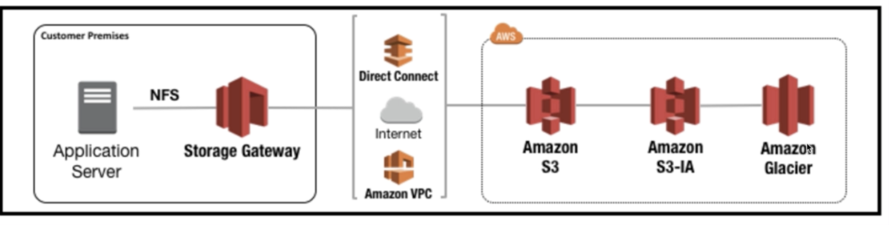

# Storage Gateway

## 1. What is Storage Gateway?

AWS Storage Gateway is a service that conntects an on-premises software appliances with cloud-based storage to provide seamless and secure integration between an organization's on-premises IT environment and AWS's storage infrastucture. The service enables you to securely store data to the AWS cloud for scalable and cost-effective storage.

AWS Storage Gateway는 온프레미스 소프트웨어 어플라이언스를 클라우드 기반 스토리지에 연결하여 데이터 보안 기능으로 온프레미스 IT 환경과 AWS 스토리지 인프라 사이에 원활한 통합이 이루어지도록 지원한다. 이 서비스를 사용하면 AWS 클라우드에 데이터를 저장하여 데이터 보안 유지에 도움이 되는 확장 가능하면서 비용 효율적인 스토리지를 구현할 수 있다.

AWS Storage Gateway's software appliance is available for download as a virtual machine(VM) image that you install on a host in your datacenter. Storage Gateway supports either VMware ESXi or Microsoft Hyper-V. once you've installed your gateway and associated it with your AWS account through the activation process, you can use the AWS Management Console to create the storage gateway option that is right for you.

## 2. The three different types of Storage Gateway

- File GateWay(NFS & SMB)
- Volumn Gateway(iSCSI)
  - Stored Volumes
  - Cached Volumes
- Tape Gateway

## 3. File Gateway

Files are stored as objects in your S3 buckets, accessed through a Network File System(NFS) mount point. Ownership, permissions, and timestamps are durably stored in S3 in the user-metadata of the object associated with the file. Once object are transferred to S3, they can be managed as native S3 objects, and bucket policies such as versioning, lifecycle management, and cross-region replication apply directly to objects stored in your bucket.

파일 게이트웨이는 Amazon Simple Storage Service(Amazon S3)에 대한 파일 인터페이스를 지원하고 서비스와 가상 소프트웨어 어플라이언스를 결합한다. 이 조합을 사용하면 NFS(Network File System) 및 SMB(Server Message Block) 같은 업계 표준 파일 프로토콜을 사용하여 Amazon S3에서 객체를 저장하고 검색할 수 있다.
애플리케이션은 NFS 또는 SMB를 통해 파일과 디렉터리를 읽고 쓰면서 파일 서버로서 게이트웨이와 상호 작용한다. 게이트웨이는 이러한 파일 작업을 S3 버킷에 대한 객체 요청으로 전환한다. 지연 시간이 짧은 액세스를 위해 가장 최근에 사용된 데이터가 게이트웨이에 캐시되고, 게이트웨이에서 데이터 센터와 AWS 간 데이터 전송을 모두 관리하고 최적화한다. 객체가 S3에 저장되면 객체에 직접 액세스하거나 S3 수명 주기 정책, 교차 리전 복제 등의 기능을 사용해 관리할 수 있다. 온프레미스 또는 EC2에서 파일 게이트웨이를 실행할 수 있다.

## 4. Volume Gateway

The volume interface presents your applications with disk volumes using the iSCSI block protocol.
Data written to these volumes can be asynchronously backed up as point-in-time snapshots of your volumnes, and stored in the cloud as Amazon EBS snapshots.
Snapshots are incremental backups that capture only changed blocks. All snapshot storage is also compressed to minimize your storage charges.

- 볼륨 게이트웨이는 온프레미스 애플리케이션 서버에서 iSCSI(Internet Small Computer System Interface) 장치로 탑재할 수 있도록 클라우드 기반 스토리지 볼륨을 제공한다. 이를 통해 블록 스토리지 볼륨을 생성하고 온프레미스 또는 EC2 애플리케이션 서버에서 이를 iSCSI 디바이스로서 탑재할 수 있다. 볼륨 게이트웨이는 캐싱 모드 또는 저장 모드로 실행된다.
- 볼륨 게이트웨이는 iSCSI 연결을 사용하여 온프레미스 애플리케이션에 블록 스토리지를 제공한다. 볼륨의 데이터는 Amazon S3에 저장되며, 사용자는 특정 시점의 볼륨 복사본을 생성할 수 있고 이는 AWS에 Amazon EBS 스냅샷으로 저장된다. 또한 AWS Backup을 사용하여 볼륨의 복사본을 가져와서 보존 관리를 수행할 수도 있다. EBS 스냅샷을 볼륨 게이트 웨어 볼륨 또는 EBS 볼륨에 저장할 수 있다.
  - 캐싱 모드에서는 기본 데이터가 S3에 작성되는 반면, 자주 액세스하는 데이터는 액세스 지연 시간을 줄이기 하기 위해 로컬로 캐시에 보존한다.
  - 저장 모드에서는 기본 데이터가 로컬로 저장되고 액세스 지연 시간을 짧게 유지하기 위해 전체 데이터 세트가 제공되고 AWS에 비동기식으로 백업된다.
- 어느 모드에서든 볼륨의 특정 시점 스냅샷을 생성하고 이를 AWS의 Amazon EBS 스냅샷으로 저장할 수 있으므로 데이터 보호, 복구, 마이그레이션 및 다양한 기타 사본 데이터 요구에 맞게 버전 지정된 볼륨 복사본을 공간 효율적으로 생성할 수 있다.

### 1) Volume Gateway - Stored Volumes

Stored volumes let you store your primary data locally, while asynchronously backing up that data to AWS. Stored volumes provide your on-premises applications with low-latency access to their entire datasets, while providing durable, off-site backups. You can create storage volumes and mount them as iSCSI devices from your on-premises application servers. Data written to your stored volumes is stored on your on-premises storage hardware. This data is asynchronously backed up to Amazon Simple Storage Service(Amazon S3) in the form of mazon Elastic Block Store(Amazon EBS) snapshots. 1GB - 16TB in size for Stored Volumes.
