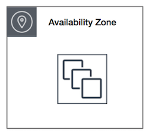
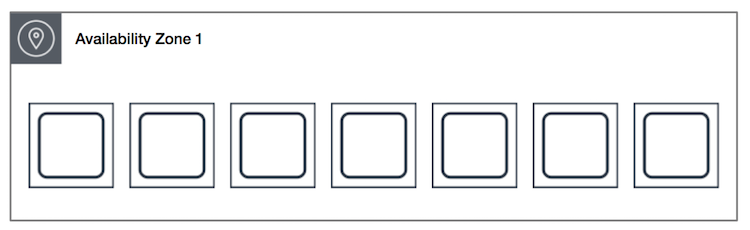

# EC2

## 1. What is EC2?

Amazon Elastic Compute Cloud(Amazon EC2) is a web service that provieds resizable compute capacity in the cloud. Amazon EC2 reduces the time required to obtain and boot new server instances to minutes, allowing you to quickly scale capacity, both up and down, as your computing requirements change.

- Termination Protection is turned off by default, you must turn in on
- On an EBs-backed instance, the default action is for the root EBS volume to be deleted when the instance is terminated.
- EBS Root Volumes of your DEFAULT AMI's CAN be encrypted. you can also use a third pary tool (Such as bit locker etc) to encrypt the root volume, or this can be done when creating AMI's in the AWS console or using the API.
- Additional volumes can be encrypted.

<br>

## 2. EC2 요금

### 1) 온디맨드

온디맨드 인스턴스에서는 실행하는 인스턴스에 따라 시간당 또는 초당 컴퓨팅 파워에 대한 비용을 지불합니다. 장기 약정이나 선결제 금액은 필요 없습니다. 애플리케이션 수요에 따라 컴퓨팅 파워를 늘리거나 줄일 수 있으며 사용한 인스턴스에 대해 지정된 시간당 요금만 지불하면 됩니다.

- 선결제 금액이나 장기 약정 없이 저렴하고 유연하게 Amazon EC2를 사용하기 원하는 사용자
- 단기의 갑작스럽거나 예측할 수 없는 워크로드가 있으며, 중단되어서는 안 되는 애플리케이션
- Amazon EC2에서 처음으로 개발 또는 시험 중인 애플리케이션

### 2) 스팟 인스턴스

Amazon EC2 스팟 인스턴스를 사용하면 온디맨드 요금보다 최대 90% 할인된 가격으로 예비 Amazon EC2 컴퓨팅 용량을 요청할 수 있습니다.

- 시작 및 종료 시간이 자유로운 애플리케이션
- 컴퓨팅 가격이 매우 저렴해야만 수익이 나는 애플리케이션
- 대량의 서버 용량 추가로 긴급히 컴퓨팅 파워가 필요한 사용자

### 3) 예약 인스턴스

예약 인스턴스는 온디맨드 인스턴스 요금과 비교하여 상당한 할인 혜택(최대 75%)을 제공합니다. 또한, 예약 인스턴스를 특정 가용 영역에 지정하면 용량 예약이 제공되므로 필요할 때 예약한 인스턴스를 시작할 수 있다는 확신을 가질 수 있습니다.
수요가 꾸준하거나 예측 가능한 애플리케이션의 경우, 예약 인스턴스를 사용하면 온디맨드 인스턴스 사용과 비교하여 상당한 비용을 절감할 수 있습니다.

- 수요가 꾸준한 애플리케이션
- 예약 용량이 필요할 수 있는 애플리케이션
- 총 컴퓨팅 비용을 절감하기 위해 1년 또는 3년 동안 EC2를 사용하기로 약정할 수 있는 고객

#### 예약 인스턴스 구매 옵션

- **표준 예약 인스턴스**: 표준 예약 인스턴스는 온디맨드 인스턴스 요금과 비교하여 상당한 할인 혜택(최대 75%)을 제공하며 1년 또는 3년 약정으로 구매할 수 있습니다. 고객은 표준 예약 인스턴스의 가용 영역, 인스턴스 크기 및 네트워킹 유형을 유연하게 변경할 수 있습니다.

- **컨버터블 예약 인스턴스**: 약정 기간에 다른 인스턴스 패밀리, 운영 체제 또는 테넌시를 사용할 수 있는 추가적인 유연성이 필요한 경우 컨버터블 예약 인스턴스를 구매할 수 있다. 컨버터블 예약 인스턴스는 온디맨드 인스턴스와 비교하여 상당한 할인 혜택(최대 54%)을 제공하며 1년 또는 3년 약정으로 구매할 수 있습니다.

- **예정된 예약 인스턴스**: 반복적인 일정에 따라 예약 인스턴스를 구매하면, 시간당 컴퓨팅 파워에 대한 요금을 지불하고 필요한 시간 기간에 대해서만 미리 용량을 예약할 수 있습니다.

### 4) 전용 호스팅

전용 호스팅은 고객 전용의 물리적 EC2 서버입니다. 전용 호스팅을 사용하면 Windows Server, SQL Server, SUSE Linux Enterprise Server(라이선스 약관에 따름)를 비롯한 기존 서버 한정 소프트웨어 라이선스를 사용할 수 있으므로 비용을 절감할 뿐 아니라 규정 준수 요구 사항도 충족할 수 있습니다

- 온디맨드로 구매 가능(시간당).
- 온디맨드 요금과 비교하여 최대 70% 할인된 예약 인스턴스로 구매 가능.

<br>

## 3. EC2 인스턴스 타입

- **F**: For FPGA
- **I**: For IOPS
- **G**: Graphics
- **H**: High Disk Throughput
- **T**: Cheap general purpose(think T2 Micro)
- **D**: For Density
- **R**: For RAM
- **M**: Main choice for general purpose apps
- **C**: For Compute
- **P**: Graphics(thick Pics)
- **X**: Extreme Memory
- **Z**: Extreme Memory and CPU
- **A**: Arm-based workloads
- **U**: Bare Metal

<br>

## 4. Security Group

보안 그룹은 인스턴스에 대한 인바운드 및 아웃바운드 트래픽을 제어하는 가상 방화벽 역할을 합니다.

- All Inbound traffic is blocked by default.
- All Outbound traffic is allowed.
- Changes to Security Groups take effect immediately
- You can have any number of EC2 instances within a security group
- You can have multiple security groups attached to EC2 instances.
- Security Groups are STATEFUL.
- If you create an inbound rule allowing traffic in, that traffic is automatically allowed back out again.
- You caannot block sepecific IP addresses using Security Groups, instead use Network Access Control Lists.
- 허용 규칙을 지정할 수 있지만 거부 규칙은 지정할 수 없습니다.
- 인바운드 트래픽과 아웃바운드 트래픽에 별도의 규칙을 지정할 수 있습니다.
- 기본적으로 보안 그룹은 모든 아웃바운드 트래픽을 허용하는 아웃바운드 규칙을 포함합니다. 규칙을 제거할 수 있으며 특정 아웃바운드 트래픽만 허용하는 아웃바운드 규칙을 추가할 수 있습니다. 보안 그룹에 아웃바운드 규칙이 없는 경우 인스턴스에서 시작하는 아웃바운드 트래픽이 허용되지 않습니다.

<br>

## 5. Using IAM Roles with EC2
 - Roles are more secure than storing your access key and secret access key on individual EC2 instance.
 - Roles are easier to manage.
 - Roles can be assigned to an Ec2 instance after it is created using both the console & command line.
 - Roles are universal - you can use them in any region.

<br>

## 6. Using Boot Strap Scripts
Amazon ECS 컨테이너 인스턴스를 시작할 때 사용자 데이터를 인스턴스에 전달할 수 있는 옵션이 있습니다. 이 데이터는 일반적인 구성 작업을 자동으로 수행하는 데 사용할 수 있고, 인스턴스가 부팅될 때 스크립트를 실행하는 데 사용할 수도 있습니다.

```
#!/bin/bash
yum update -y
yum install httpd -y
service httpd start
chkconfig httpd on
cd /var/www/html
echo "<html><h1>Hello Cloud Gurus Welcome To My Webpage</h1></html>"  >  index.html
aws s3 mb s3://YOURBUCKETNAMEHERE
aws s3 cp index.html s3://YOURBUCKETNAMEHERE
```

<br>

## 7. EC2 Instance Meta Data
인스턴스 메타데이터는 실행 중인 인스턴스를 구성 또는 관리하는 데 사용될 수 있는 인스턴스 관련 데이터입니다. 인스턴스 메타데이터는 예를 들어 호스트 이름, 이벤트 및 보안 그룹과 같은 범주로 분류됩니다.
IP 주소 169.254.169.254는 링크-로컬 주소이며 인스턴스에서만 유효합니다.

실행 중인 인스턴스 내에 있는 인스턴스 메타데이터의 모든 범주를 보려면 다음 URI를 사용하십시오.

```
$ curl http://169.254.169.254/latest/meta-data/
```

실행 중인 인스턴스 내에서 사용자 데이터를 가져오려면 다음 URI를 사용합니다.
[인스턴스 사용자 데이터 검색](https://docs.aws.amazon.com/ko_kr/AWSEC2/latest/UserGuide/instancedata-add-user-data.html)
사용자 데이터를 요청하면 데이터 자체(application/octet-stream)가 반환된다. 쉼표로 구분된 텍스트 또는 스크립트로 제공된 사용자 데이터를 반환할 수 있다.

```
http://169.254.169.254/latest/user-data
```

- Used to get information about an isntance(such as public ip)
- curl http://169.254.169.254/latest/meta-data/
- curl http://169.254.169.254/latest/user-data/

<br>

## 8. EC2 Placement Groups
새 EC2 인스턴스를 시작하면 EC2 서비스는 모든 인스턴스가 기본 하드웨어 전반에 분산되도록 하여 상호 관련 오류의 위험을 줄입니다. 워크로드의 유형에 따라 다음 배치 전략 중 하나를 사용하여 배치 그룹을 생성할 수 있습니다.

#### Three Types of Placement Groups;
 - Clustered Placement Group (클러스터 배치 그룹)
    - Low Netowrk Latency / High Network Throughput
 - Spread Placement Group (분산 배치 그룹)
    - individual Critical EC2 instance
 - Partitioned (파티션 배치 그룹)
    - Multiple EC2 instances HDFS, HBase, and Cassandra

### 1) Clustered Placement Group
A cluster placement group is a grouping of instances within a single Availability Zone. Placment groups are recommended for applications that need low network latency, high network throughput, or both.
Only certian instances can be launched in to a Clustered Placement Group.

인스턴스를 가용 영역 안에 서로 근접하게 패킹합니다. 이 전략은 워크로드가 HPC 애플리케이션에서 일반적인 긴밀히 결합된 노드 간 통신에 필요한 낮은 지연 시간의 네트워크 성능을 달성할 수 있습니다. 클러스터 배치 그룹은 단일 가용 영역 내에 있는 인스턴스의 논리적 그룹입니다. 클러스터 배치 그룹은 짧은 네트워크 지연 시간, 높은 네트워크 처리량 또는 둘 다의 이점을 활용할 수 있는 애플리케이션에 권장됩니다. 또한 대부분의 네트워크 트래픽이 그룹 내 인스턴스 간에 전송되는 경우에도 권장됩니다



### 2) Spread Placment Group
A spread placement group is a group of instances that are each placed on distrinct underlying hardware. Spread placement groups are recommended for applications that have a small number of critical instances that should be kept seperate from each other.

분산형 배치 그룹은 각각 고유한 랙에 배치된 인스턴스 그룹이며 랙마다 자체 네트워크 및 전원이 있습니다. 서로 떨어져 있어야 하는 중요 인스턴스의 수가 적은 애플리케이션에서는 분산형 배치 그룹이 권장됩니다. 분산형 배치 그룹에서 인스턴스를 시작하면 인스턴스가 동일한 랙을 공유할 때 장애가 동시에 발생할 수 있는 위험이 줄어듭니다. 분산형 배치 그룹은 별개의 랙에 대한 액세스를 제공하기 때문에 시간에 따라 인스턴스를 시작하거나 인스턴스 유형을 혼합할 때 적합합니다. 분산형 배치 그룹은 동일한 리전의 여러 가용 영역에 적용될 수 있습니다. 그룹당 가용 영역별로 최대 7개의 실행 중인 인스턴스를 가질 수 있습니다.



INDIVIDUAL INSTANCES

### 3) Partitioned
When using partition placement groups, Amazon EC2 divides each group into logical segments called partitions. Amazon EC2 ensures that each partition within a placment group has its own set of racks. Each rack has its own network and power source. No two partitions within a placement group share the same racks, allowing you to isolate the impact of hardware failure within your application.
파티션 배치 그룹은 애플리케이션에 대한 상관 관계가 있는 하드웨어 장애 가능성을 줄이는 데 도움이 됩니다. 파티션 배치 그룹을 사용할 때 Amazon EC2는 각 그룹을 파티션이라고 하는 논리 세그먼트로 나눕니다. Amazon EC2는 배치 그룹 내 각 파티션에 자체 랙 세트가 있는지 확인합니다. 각 랙은 자체 네트워크 및 전원이 있습니다. 배치 그룹 내 두 파티션이 동일한 랙을 공유하지 않으므로 애플리케이션 내 하드웨어 장애의 영향을 격리시킬 수 있습니다.


MULTIPLE INSTANCES

<br>

각 파티션은 여러 인스턴스로 구성됩니다. 각 파티션에 있는 인스턴스는 다른 파티션에 있는 인스턴스와 랙을 공유하지 않기 때문에 단일 하드웨어 장애의 영향을 관련 파티션으로만 국한할 수 있습니다. 파티션 배치 그룹은 동일한 리전의 여러 가용 영역에서 파티션을 가질 수 있습니다. 파티션 배치 그룹은 가용 영역당 파티션을 최대 7개까지 가질 수 있습니다.

- A clustered placement group can't span multiple Availability Zones. A spread placement and partitioned group can.
- The name you specify for a placement group must be unique within your AWS account.
- Only certian types of instances can be launched in a placement group (Compute Optimized, GPU, Memory Optimized, Storage Optimized)
- AWS recommend homogenous instances within clustered placement groups.
- You can't merge placement groups.
- You can move an existing instance into a placement group. Before you move the instance, the instance must be in the stopped state. You can move or remove an instance using the AWS CLI or an AWS SDK, you can't do it via the console yet.